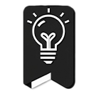

# MarkMind - AI-Powered Bookmark Organization

<div align="center">
  
  <p><strong>Transform your chaotic bookmarks into organized bliss with AI</strong></p>
  <p>
    <a href="https://chromewebstore.google.com/detail/MarkMind/bdobgdkpeffdbonfpokgkbncgnbnjnoo">
      
    </a>
    <a href="https://github.com/migsilva89/MarkMind/issues">
      
    </a>
    <a href="https://github.com/migsilva89/MarkMind/blob/main/src/docs/LICENSE">
      
    </a>
  </p>
</div>

## ✨ Why MarkMind?

MarkMind replaces Chrome's native bookmark button with AI-powered organization that actually understands what you're saving. One click and your bookmarks find their perfect home - automatically!

<div align="center">
  
</div>

### 🌟 Key Features

- **Smart Organization**: AI that understands your bookmarks and categorizes them intelligently
- **Bulk Processing**: Organize hundreds of bookmarks while you grab coffee ☕
- **Privacy Obsessed**: All processing happens locally - your bookmarks are YOUR business
- **You're The Boss**: Review and approve all changes before applying them
- **Respects Your Chaos**: Works with your existing folder structure (no judgment here!)

## 🚀 Getting Started

### Quick Install
1. [Add MarkMind from the Chrome Web Store](https://chrome.google.com/webstore/detail/markmind/[your-extension-id])
2. Get a free [Google AI Studio](https://aistudio.google.com/app/apikey) API key
3. Click the MarkMind icon and enter your API key in settings
4. Start organizing your bookmarks with AI!

### Using MarkMind

**Organize Existing Bookmarks:**
1. Click the MarkMind icon
2. Select bookmarks to organize
3. Click "Organize Selected"
4. Review and approve the suggested structure

**Add Current Page:**
1. Click the MarkMind icon while browsing
2. Select "Add Current Page"
3. Watch as the page is bookmarked and automatically organized

## 🔒 Privacy & Security

- Your bookmarks never leave your browser
- Only bookmark titles and URLs are sent to Google's AI
- API key is stored securely in your browser
- No personal data is collected or tracked

## 🛠️ For Developers

MarkMind is open source and welcomes contributions!

### Project Structure

```
src/
├── js/
│   ├── popup.js           # Main UI logic
│   ├── background.js      # Background service worker
│   ├── config.js          # Configuration settings
│   └── services/
│       └── geminiService.js  # AI service integration
├── css/
│   └── style.css         # Styles for the extension
├── assets/
│   └── icons/            # Extension icons
├── manifest.json
└── popup.html
```

### Local Development

1. Clone this repository
```bash
git clone https://github.com/migsilva89/MarkMind.git
cd MarkMind
```

2. Load the extension in Chrome:
   - Go to `chrome://extensions/`
   - Enable "Developer mode"
   - Click "Load unpacked"
   - Select the `src` folder

3. Get a [Google AI Studio](https://makersuite.google.com/app/apikey) API key

4. After making changes, reload the extension in Chrome to test

### Contributing

We welcome contributions! Here's how:
1. Fork the project
2. Create your Feature Branch (`git checkout -b feature/AmazingFeature`)
3. Commit your changes (`git commit -m 'Add some AmazingFeature'`)
4. Push to the Branch (`git push origin feature/AmazingFeature`)
5. Open a Pull Request

## 📋 Roadmap

- [ ] Export/Import functionality
- [ ] Custom folder depth configuration
- [ ] Additional AI models support
- [ ] Batch processing improvements
- [ ] Cross-device synchronization

## 📸 Screenshots

<div align="center">
  
  <p><em>Add current page feature</em></p>
  
  
  <p><em>Add multiple feature</em></p>
  
  
  <p><em>Get Gemini Api key</em></p>
</div>

## 🤝 Support

Need help or have questions?
- [Open an issue](https://github.com/migsilva89/MarkMind/issues) on GitHub
- Email us at: themarkmind@gmail.com
- Visit our website: [markmind.xyz](https://markmind.xyz)

## 📜 License

This project is licensed under the MIT License - see the [LICENSE](LICENSE) file for details.

---

<div align="center">
  <p>Made with ❤️ for better bookmark organization</p>
  <p>If you find MarkMind useful, consider <a href="https://github.com/migsilva89/MarkMind">giving it a star ⭐</a></p>
</div>